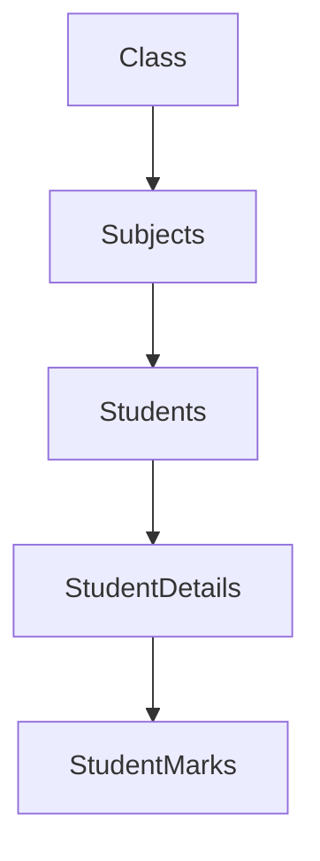
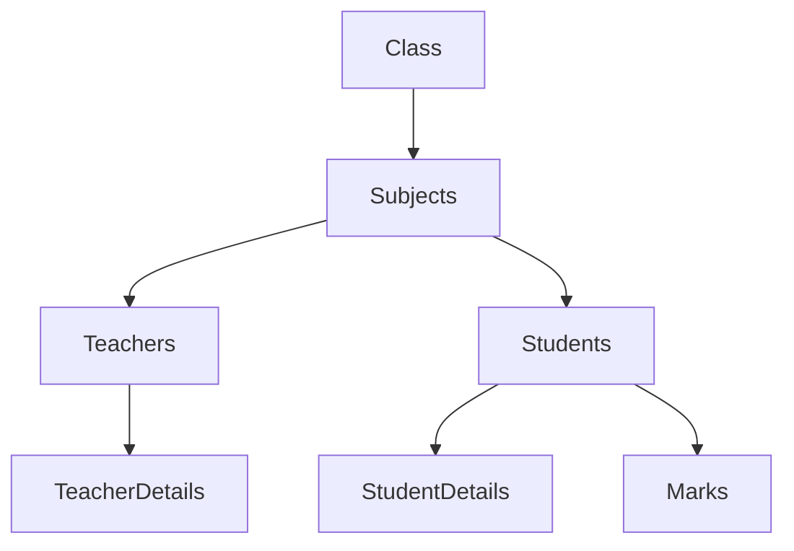
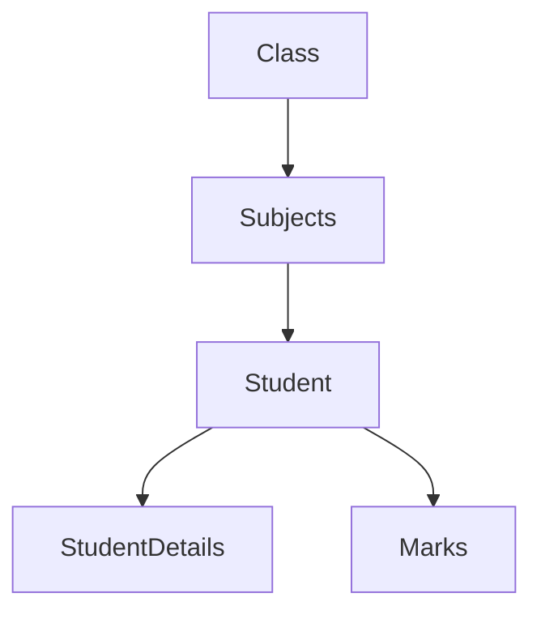
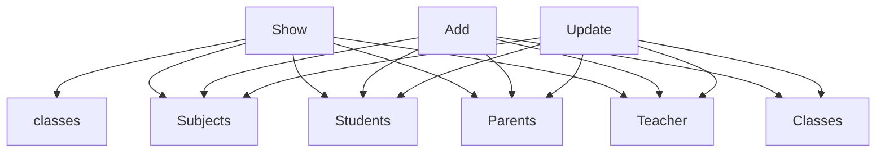
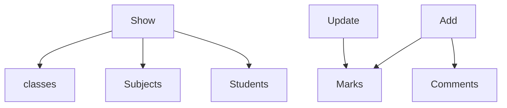
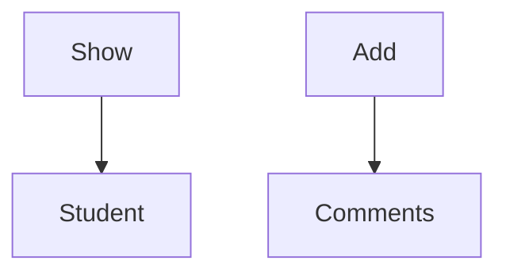

# Admin

```mermaid
graph TD;
    Class-->Subjects;
    Subjects-->Students;
    Students-->StudentDetails;
    StudentDetails-->StudentMarks;

```

# Teacher

```mermaid
graph TD;
    Class-->Subjects;
    Subjects-->Teachers;
    Teachers-->TeacherDetails;
    Subjects-->Students;
    Students-->StudentDetails
    Students-->Marks;

```

# Parents

```mermaid
graph TD;
    Class-->Subjects;
    Subjects-->Student;
    Student-->StudentDetails;
    Student-->Marks;

```

# Admin access

```mermaid
graph TD;

    Show-->classes
    Show-->Subjects
    Show-->Students
    Show-->Parents
    Show-->Teacher

    Add-->Classes
    Add-->Subjects
    Add-->Students
    Add-->Parents
    Add-->Teacher

    Update-->Classes
    Update-->Subjects
    Update-->Students
    Update-->Parents
    Update-->Teacher

```

# Teacher access

```mermaid
graph TD;

    Show-->classes
    Show-->Subjects
    Show-->Students

    Add-->Marks
    Add-->Comments

    Update-->Marks

```

# Parent access

```mermaid
graph TD;

    Show-->Student

    Add-->Comments

```
